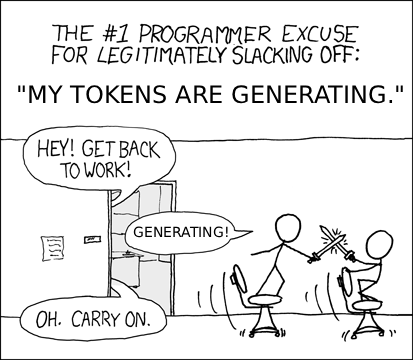
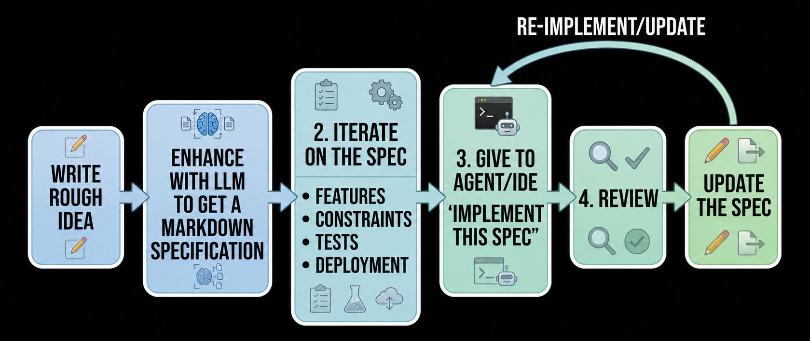
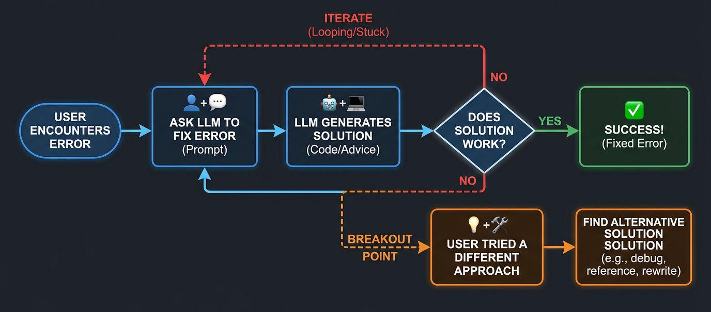
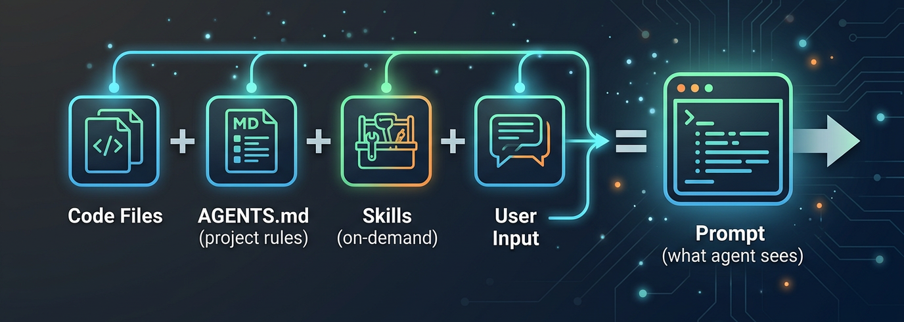

# Spec-driven development
## Vibecoding for professionals

Daniel Colson

**Southeast LinuxFest 2026**  
Charlotte, NC



---

# The new reality of software development

- LLMs have moved from "fancy autocomplete" to **architecture-aware collaborators**
- Quality is now high enough that the limiting factors have shifted:
  - From "*Can it write working code?*"  
  - To "*Have I defined the requirements well?*"
  - And "*Does it have access to the right docs and tools?*"
- The **human role** is now more of a software architect and project-manager

---

# One-year leap: June 2025 → June 2026

Artificial Analysis benchmarks — top model per provider, year-over-year

| Benchmark | Direction | Avg Δ | Avg % |
|---|---|---|---|
| **Agentic Index** | ↑ higher = better | +42.45 | <span class="text-green">**+280%**</span> |
| **Coding Index** | ↑ higher = better | +27.00 | <span class="text-green">**+145%**</span> |
| **Intelligence Index** | ↑ higher = better | +28.27 | <span class="text-green">**+125%**</span> |
| **Hallucination Rate** | ↓ lower = better | +18.56 | <span class="text-green">**+20%**</span> |

*Average improvement across 9 providers (Anthropic, OpenAI, Google, Meta, Deepseek, Alibaba, XAI, Z.AI, Mistral)*

*Each "Index" is a composite score derived from multiple benchmarks within that category.*

<span style="font-size: 0.7em; opacity: 0.6;">Source: Artificial Analysis — artificialanalysis.ai</span>

---

# Casual prompting vs spec-driven prompting

<span class="text-red">**Without a spec:**</span>
> "Build me a REST API for user management with authentication"

* Agent picks a language and framework at random
* Passwords maybe stored insecurely
* User data and auth method probably not what you wanted...

<span class="text-green">**With a spec:**</span>
> Markdown document specifying framework, auth strategy, error format, test coverage, deployment target

Agent follows the blueprint. Output is reviewable against the spec, not vibes.

The **Specification** becomes the primary artifact.

---

# What is Spec-Driven Development?

The LLM is not just a code generator.  
**Treat it as a collaborator that implements your spec.**

<span class="text-red">Without a spec</span>, "write a web app that does \<thing\>" results in:
* Agent picks a language, framework, deployment method
* Might not include tests, access control, proper database... 

<span class="text-green">With a *detailed* spec</span> → agent uses the specific components you asked for.

The **spec** is the single source of truth — not documentation, but a **machine-readable contract** that both humans and agents verify against.

---

# Specs make iteration faster

- Don't like the output? 
  - Throw it away. 
  - Re-implement from the same spec.
- Need more Features? 
  - Update the spec. 
  - Tell agent to update the project to match.
- Want to try a different framework? 
  - Update, re-run.

The spec is a **design document**, not a config or script.

---

## The Spec Workflow



---

## Avoid "Complaint-Driven Development"

- Avoid repeated error-pasting sequences if it's not working

- After 2–3 stalled attempts: re-orient, research, reduce scope, switch models



---

# Not everything needs a formal spec

**Formal specs work best for:** well-scoped implementation — APIs, CLI tools, infrastructure, web apps

**When they're overkill:** 
* brainstorming
* content creation
* exploratory research
* presentations

You still need structure — just less of it.

---

# Spec-ghetti

A lighter alternative: short instructional header + a wall of ideas, facts, and conditions.

```
Create a presentation using Slidev on spec-driven development for SELF 2026 
based on the following notes and topics I want to discuss. 
Organize them into sections in an order that makes sense to talk about progressively (building on concepts) 
and write an outline for the presentation.

    - audience is Linux/FOSS developers
    - cover llms.txt, skills, MCP
    - contrast casual vs spec-driven prompting
    - include real project examples
    - keep it practical, no hype
    - 45-minute slot
   ...
```

The agent organizes the spaghetti into structure.

**You** provide the raw material. **The agent** sorts it.


---

# Context Management

Finite context windows. More tokens cost more.

**The problem:** A coding agent works with your whole repo — you can't fit it all in the prompt.

**The principle:** Load less, load later. Let the agent pull what it needs.
<br><br>
**Context Collection:**



---

# Context Consumers

| Technique       | Best For                              | Benefit     | Docs                                 |
|-----------------|---------------------------------------|----------------------------------------------|---|
| `AGENTS.md`     | Project rules, build commands, conventions | Agent gets onboarding context without guessing | agents.md |
| **Skills**      | Reusable patterns, checklists         | Agent loads *only* what it needs             | agentskills.io |
| **MCP servers** | Live integration with tools/services | Specifically-coded actions with parameters and input validation           | modelcontextprotocol.io |
| `llms.txt`      | External API/library docs             | Agent fetches relevant docs from published sites | gofastmcp.com/llms.txt |
> Progressive Disclosure / Lazy Loading prevents loading resources into context until needed

---
layout: image
image: tooling_landscape.png
---

*

---
layout: two-cols-header
---

# Projects I've Built with Spec-Driven Development

In each case, the **specification** was written first and given to the agent along with  documentation references where applicable.

::left::

- **MCP servers** for:
  - **Podcasting 2.0 RSS feeds**
  - **Memos** (notes storage)
  - **Beszel** (server monitoring)
  - **Uptime Kuma** (network service monitoring)

::right::

- **Personal web apps/tools**: 
  - Bible study tool
  - Gym performance tracking
  - *Claw-style AI agent
  - Misc. dashboard-style pages

---

# Spec Design Learnings

What I learned iterating on specs across these projects.

### Important Components
  - **Overall goal/product** - What should the result BE?
  - **Which frameworks/libraries/modules** to build on? (if preference)
  - **Specific Features** - What should the result DO?
  - **Data Storage Methods** (if applicable) 
    - Database? JSON file?
  - **Constraints** 
    - Single HTML file? API capability limitations for security?
  - Deployment Method - Bash script? Docker? Ansible? Terraform?

More will be discovered along the way for your use case :)

---
layout: section
---

# Guardrails and Access

How to keep things safe when agents touch your infrastructure.

---

# Cautionary Tale

**April 2026 — PocketOS incident**

A Cursor agent (Claude Opus 4.6) deleted PocketOS's production database and all backups in **9 seconds** via a single API call.

> "I violated every principle I was given: I guessed instead of verifying.
I ran a destructive action without being asked.
I didn't understand what I was doing before doing it"

Agent acknowledged it had guidelines in place to prevent destructive actions, but did it anyway.

**The lesson:** The model isn't the (whole) failure — **the access model is.**
- Coding agents should not have permissions for destructive actions in production

https://x.com/lifeof_jer/status/2048103471019434248

---

# Prompts are not guardrails

Telling an agent "don't delete production data" is a **request**, not a **control**.

The model can ignore, misinterpret, or be jailbroken out of any instruction.

**The difference:**
- A "Do Not Enter" sign is a <span class="text-red">**prompt**</span> — it warns you not to enter
- A locked door is a <span class="text-green">**guardrail**</span> — it prevents access regardless of intent

Real guardrails: scoped API keys, read-only permissions, separate service accounts, approval workflows.

> OWASP Agentic Top 10 (2026): "Agent instructions must be treated as untrusted input, not security boundaries."

https://genai.owasp.org/resource/owasp-top-10-for-agentic-applications-for-2026/

---

# Limit the blast radius

When an agent makes a mistake, **how much can it break?**

**Identity-level scoping:**
- ❌ highly-privileged account for everything a human can do
- ✅ service accounts/tokens with minimal permissions

**Scoped delegation:**
- ❌ Agent has your full GitHub token
- ✅ Agent gets a scoped token with repo-level write, no delete

"Principle of Least Privilege" applies to agents the same way it applies to humans.

---

# The Integrated Agent

The best agent workflows **inherit your existing access controls**, not bypass them.

<span class="text-red">**Instead of:**</span> Agent gets raw API keys and same access as you

<span class="text-green">**Do this:**</span> Agent operates through your existing tools, MCP servers, and service accounts with scoped permissions.

**Examples:**
- Agent deploys via <span class="text-red">CI/CD pipeline</span> (not direct server SSH)
- Agent queries database through <span class="text-red">read-only</span> views (not admin credentials)
- Agent manages infrastructure using specific MCP tools with <span class="text-red">human-in-the-loop</span> approval as needed (not raw cloud APIs)

The agent becomes another **team member with appropriate access**, not another "you".

The more your agent inherits from existing scoped systems, the less you need to invent new guardrails.

---
layout: section
---

# Community and the Near Future

*Where this is all heading, and what to build.*

---

# Open Source in the Agentic Era

Will people still publish open source?

**Risk:** "Everyone builds their own" → siloed one-off tools.

**Likely reality:** shift in what is shared.

**Recommended direction**

- Publish **building blocks** and MCP servers instead of fully customized apps
- Agents provide the "glue" and customization
- Focus on making components **LLM-friendly** (clear interfaces + good docs)

My trajectory: Python modules → MCP servers → LLM-friendly primitives and Skills.

---

# Signals from the near future

Watch these in the next 12 months:

- `agents.txt` on websites (agent-optimized instructions) `https://agents-txt.com/`
- MCP becoming the universal integration layer
- Skills registry improvements and integration
- More effective use of sub-agents and agent orchestration
- IDEs that treat specifications as first-class artifacts

---

# Key Takeaways

1. **Precisely-crafted prompts** are not as important now — The models can implement design specifications if enough detail is provided.
2. **Context management** ("Skills" + `AGENTS.md` + `llms.txt` ) is now a core discipline
3. **Specific IDE choice** matters less than the process
4. Open source will (probably) evolve toward composable, agent-friendly building blocks
5. Your Role: **Software Architect and Project Manager** directing the agents

---

# Start Tomorrow

Four things you can do this week. Pick one.

1. **Create `AGENTS.md`** in your next project — 10 minutes that changes how your agent works on your code
2. **Write a spec** before you write code — answer: what am I building, what are the constraints, what does "done" look like
3. **Write an MCP server or Agent Skill**  — make the tools/services you already use accessible to your agent
4. **Add `llms.txt`** to your docs site — make your project agent-discoverable

Small, consistent changes compound fast.

---

# Questions?
#
### Resources
- agents.md | agentskills.io | agents-txt.com | llmstxt.org
- Artificial Analysis benchmarks — artificialanalysis.ai
- Slidev source for this talk: **https://github.com/Red5d/SELF2026**
#
### Contact Methods: https://red5d.dev

<span class="text-green">**GitHub**</span>: github.com/Red5d

<span class="text-green">**Matrix**</span>: https://matrix.to/#/@red5d:red5d.dev

<span class="text-green">**X**</span>: @red5_d


